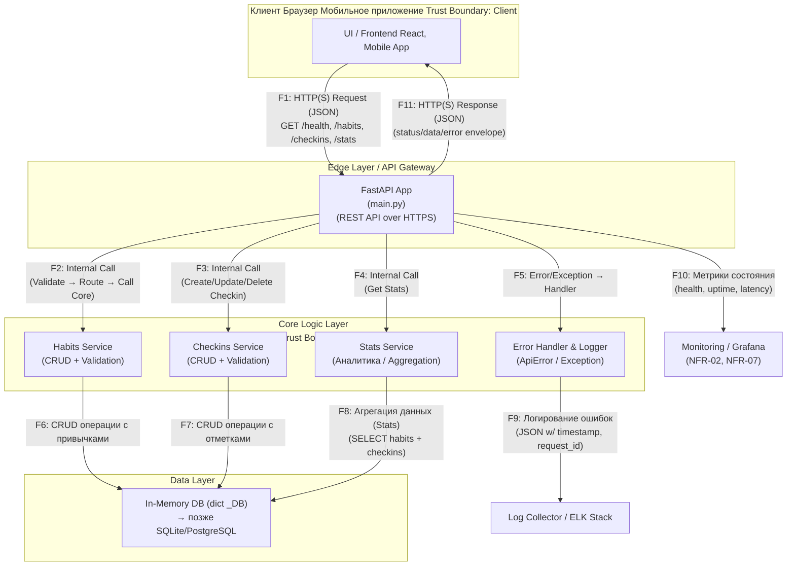

# DFD — Data Flow Diagram (шаблон)

## Диаграмма (Mermaid)

## Список потоков

| ID | Откуда → Куда | Канал/Протокол | Данные/PII | Комментарий |
|----|---------------|-----------------|------------|-------------|
| F1  | Клиент → FastAPI App             | HTTPS                  | habit data, creds                 | Вызов REST API: /health, /habits, /checkins, /stats |
| F2  | FastAPI App → Habits Service     | Internal (Python call)  | habit payload                    | Создание, чтение, обновление привычек |
| F3  | FastAPI App → Checkins Service   | Internal (Python call)  | checkin payload                   | CRUD операций с отметками выполнения |
| F4  | FastAPI App → Stats Service      | Internal (Python call)  | aggregated habit/checkin data     | Расчёт агрегированной статистики |
| F5  | FastAPI App → Error Handler      | Internal (Exception)    | error info                        | Обработка и нормализация ошибок |
| F6  | Habits Service → In-Memory DB    | In-memory (direct)      | habit records                     | CRUD операции с привычками |
| F7  | Checkins Service → In-Memory DB  | In-memory (direct)      | checkin records                   | CRUD операции с отметками |
| F8  | Stats Service → In-Memory DB     | In-memory (direct)      | habit + checkin data              | Вычисление completion_rate |
| F9  | Error Handler → Log Collector    | HTTP / JSON logs        | error metadata (timestamp, id)    | Логирование ошибок в ELK Stack |
| F10 | FastAPI App → Monitoring System  | HTTP / Prometheus Export| metrics only (no PII)             | Отправка метрик в Grafana/Prometheus |
| F11 | FastAPI App → Клиент             | HTTPS (REST JSON)       | response data (no PII)            | Ответ пользователю в формате {"error": {...}} или data |
